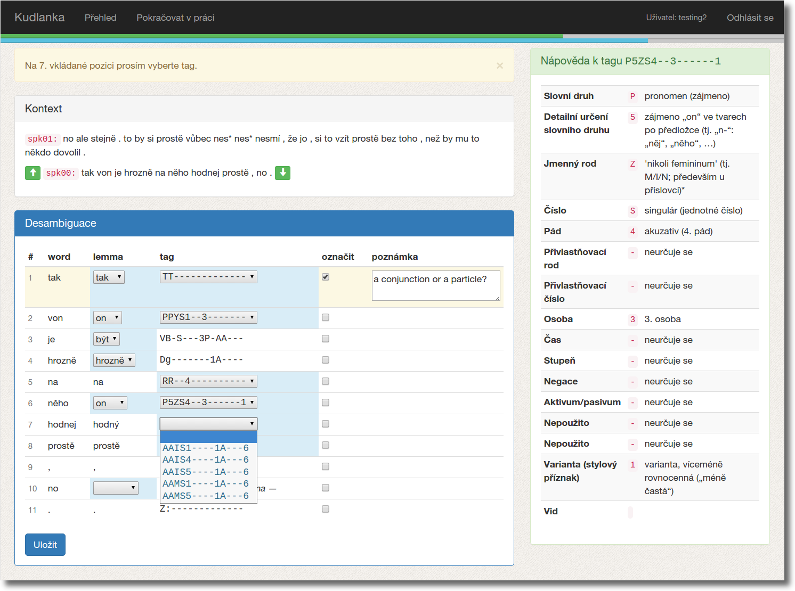

# Overview

Kudlanka is a webapp for streamlined collaborative manual morphological disambiguation
of language corpora. Here's what it looks like:



## Installation

First of all, you need access to a MongoDB instance. Then:

```sh
# optionally make a virtualenv with python3; if not, then replace `pip` with
# `pip3`
git clone <this_repository>
cd kudlanka
pipenv install --dev
bower install
pipenv run inv pybcompile jscompile
```

## Configuration

Run this from the root of the repository:

```sh
mkdir instance
cat <<EOF >instance/secret_config.py
SECRET_KEY = "foobarbaz"
SECURITY_PASSWORD_SALT = "foobarbaz"
ADMIN_PASSWD = "admin"
EOF
```

Now modify the config values in `config.py` and `instance/secret_config.py` to
your liking.

## Data import

Convert a corpus with morphological analysis in the vertical format via
`utils/vert2json.py`. Import it into MongoDB (`vert2json.py` will give a hint as
to how to do that). At this point, the app itself is ready for a spin with
`pipenv run python runserver.py`.

## User registration

Disabled ATM. Users can be added in one of these ways:

1. GUI: The admin user is able to add new users under *Management*.
2. CLI: Run `inv --help adduser` from the root of the git repository and follow
   the instructions.
3. CLI: Fire up the `mongo [dbname]` shell and add users manually with
   `db.user.insert({email: "username", password: "password"})`,

The password will be automatically hashed on first login.

## Name

Manuální disambiguace → mandis → mantis religiosa → kudlanka

## Requirements

Python3, MongoDB + see `bower.json` for client-side and `requirements.txt` for
server-side. Scripts under `utils/` may have additional dependencies, install as
needed.

# Ideas and TODOs

## Authentication via ÚČNK's LDAP

See `/home/pavelv/ratatosk/auth.py` (dependency: the `ldap3` module):

```python
Auth.auth_ucnk(username, password)
```

Problem: this probably uses flask-login, whereas I'm using the more integrated
Flask-Security solution. May require some tinkering. Another problem: I'm not
just authenticating users, I'm also storing a lot of info per user, so I'd have
to go hybrid and delegate authentication while keeping the rest in MongoDB.
Which is probably not worth the hassle at this point.

## URL prefix

Grafting the app at arbitrary prefixes is currently handled by wrapping all
routes in `kudlanka.config.k()`; perhaps it would be easier to just have an
`@app.before_request` handler which optionally redirects if a prefix is needed
(`request.host_url + prefix + request.path`). But semantically, building this
functionality on redirects is just wrong -- redirects should be used for URLs
which are not under one's control. So it doesn't make sense for the app to
generate HTML with URLs which are actually invalid and will be redirected from
when visited.

# Dev tips

- use `bower install` for fetching components like bootstrap, jquery, angular
  etc.
- use [Flask Assets](http://flask-assets.readthedocs.org/en/latest/) once it
  comes to minification
- keep track of python deps using `pip freeze >requirements.txt`
- REST validation with `reqparse` from `flask_restful`
- refreshing the `segs` database:

```
$ xzcat data/small.json.xz | sort -R | mongoimport -d ktest -c segs
```

- use `invoke` (`inv command ...`) for defining and running repetitive tasks

## i18n

- use `lazy_gettext()` everywhere, it's just simpler
- the trouble is that lazy strings which have been prepared beforehand (e.g. as
  class variables, see classes in `kudlanka.api`) need to be somehow evaluated
  when used, or they'll come out empty; this is especially valid for flash
  messages
- **workaround: call `format()` on each string used in this way**, even if it
  has no placeholders -- then the string gets evaluated in the context of the
  request

## Production setup

- couldn't get setting `APPLICATION_ROOT` to work -- probably some problems in
  the config of the Apache2 proxy?
- defined a `k()` function instead, which is used to set a specified URL prefix
  wherever necessary in the app, i.e.:
  - server-side: for all routes
  - client-side: inside the `<base>` tag of html templates

→ turns out `APPLICATION_ROOT` is only relevant for setting cookies, it has
nothing to do with setting a prefix and ensuring correct redirection. Have a
look at [this snippet](http://flask.pocoo.org/snippets/35/) instead, or at
[blueprints](http://flask.pocoo.org/docs/0.10/blueprints/), which allow to
create instances of applications and wire them up at arbitrary prefixes (among
other things).

However, blueprints are not full-fledged apps, they can't have their own
sessions grafted onto them using Flask Security, for instance. For this reason,
it's not practical or straightforward to just package an app as a blueprint and
let it run under an arbitrary prefix in a container app.

Another possibility is to use `werkzeug.wsgi.DispatcherMiddleware`, again
creating a container app and wiring sub-apps on different URL prefixes. But
unfortunately, this isn't hassle-free either, various components tend to assume
they're running under root anyway unless explicitly told otherwise (Flask
Security routes, Flask Restful routes), introducing subtle breakage.

For this reason, explicitly wrapping every route in `k()` is probably the best
option -- extensions always have a way of altering individual routes, but they
might not have an option to set a universal URL prefix. NOTE: remember to also
`Flask(..., static_url_path = k("/static"))`!

# Credits

Icons are by [Glyphicons](http://glyphicons.com/).

# License

Copyright © 2015 [ÚČNK](http://korpus.cz)/David Lukeš

Distributed under the
[GNU General Public License v3](http://www.gnu.org/licenses/gpl-3.0.en.html).
